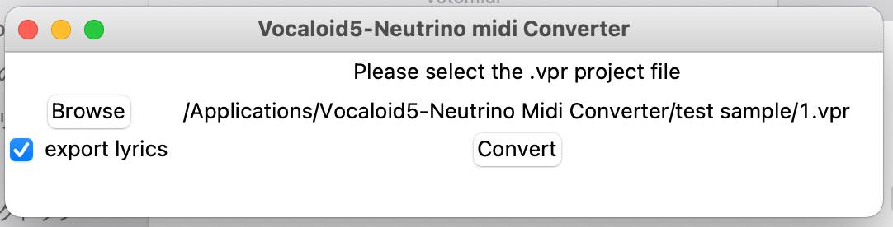

# Vocaloid5-Neutrino Midi Converter



## Introduction 
this is a convenient tool with GUI to create neutrino score file(```.xml```or ```.musicxml```) from
Vocaloid5 project(```.vpr```), by the following step:

- this tool can convert ```.vpr```to ```.mid``` with lyrics.
- import to your DAW and check the score.
- export ```.xml``` file to neutrino engine.

This tool is based on [vocaloid5tools](https://github.com/TheerapakG/vocaloid5tools). 


## Usage for MacOS
download ```v5tomidi``` folder and open ```Vocaloid5-Neutrino Midi Converter(for mac)```

## Usage for Windows
download and open ```Vocaloid5-Neutrino Midi Converter.exe```
